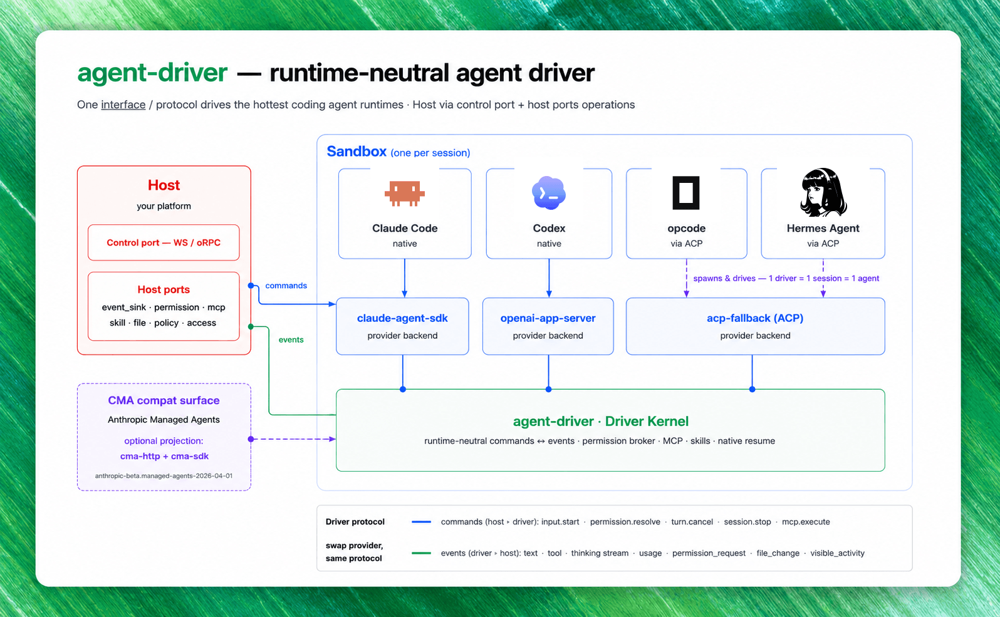

<div align="center">


<h1>mosoo-agent-driver</h1>

<strong>One Driver Kernel. Every agent backend.</strong>
<br />
The Mosoo Agent Driver — the runtime that drives a sandbox-hosted agent session inside Mosoo.

<br />
<br />

<!-- Static badges below render cleanly before the package is published. Once
     mosoo-agent-driver is public on GitHub + npm, swap in the dynamic versions:
     build:     https://img.shields.io/github/actions/workflow/status/langgenius/mosoo-agent-driver/ci.yml?branch=main&label=build
     version:   https://img.shields.io/npm/v/agent-driver?label=version
     downloads: https://img.shields.io/npm/dm/agent-driver?label=downloads -->

[](#checks)
[](./package.json)
[](./LICENSE.txt)
[](https://www.npmjs.com/package/agent-driver)

[](https://github.com/langgenius)
[](https://x.com/mosooagent)

</div>

---

`mosoo-agent-driver` (published to npm as `agent-driver`) is the standalone runtime driver for sandbox-hosted agent sessions. It runs inside the sandbox and drives a single agent session from boot to stop. The core product is the **Driver Kernel**: runtime-neutral commands, events, host ports, provider backends, and the provider registry.

CMA (the Anthropic Managed Agents compatibility surface) is layered on top of the Driver Kernel through projections. Provider backends must emit Driver runtime events and consume Driver commands; they must not emit CMA events directly.

<div align="center">



</div>

## Why agent-driver

Different model vendors ship different agent runtimes — the Claude Agent SDK, OpenAI's app-server protocol, and ACP-based agents — and each speaks its own event vocabulary. `agent-driver` unifies them at the kernel level so the host integrates **one** protocol instead of three.

- **Kernel-level unification.** Three backends — `claude-agent-sdk`, `openai-app-server` (OpenAI runtime), and `acp-fallback` — all project onto a single Driver event protocol. The host writes against one set of commands and events regardless of which vendor is behind the session.
- **Runtime-neutral by design.** The Driver Kernel owns command dispatch, runtime event emission, provider lifecycle, the permission flow, and diagnostics. Hosts own credentials, files, skills, MCP, policy, logging, persistence, and transport through well-defined host ports. The library is safe to import and never starts the process runner on its own.
- **Anthropic Managed Agents compatible.** Ships a CMA-compatible HTTP surface gated by the beta header `anthropic-beta: managed-agents-2026-04-01`, routing `/v1/agents`, `/v1/environments`, and `/v1/sessions`. A thin client and an in-memory store are included so you can stand up the full surface without external infrastructure.
- **Typed public entries.** Every public entry ships a matching declaration file under `dist/types`, and the package carries **no** `@mosoo/*` runtime dependencies — it is self-contained and portable.

## Package Entries

- Command `agent-driver`: Bun process runner, built to `dist/driver.mjs`.
- Package root `agent-driver`: Driver Kernel, provider registry, host ports, commands, events, diagnostics, the in-memory CMA store, and CMA projection exports.
- `agent-driver/boot`: process boot payload, protocol version, boot environment names, and host snapshot contracts.
- `agent-driver/runtime`: runtime-neutral runtime, transport, and native resume contracts.
- `agent-driver/paths`: sandbox path constants and path normalization helpers shared by host integrations.
- `agent-driver/events`: canonical driver event envelope contracts.
- `agent-driver/orpc`: sandbox-local driver RPC wire input/output contracts.
- `agent-driver/cma-http`: CMA-compatible HTTP surface.
- `agent-driver/cma-sdk`: thin CMA client.

Every public entry has a matching declaration file under `dist/types`.

## Quick Start

`agent-driver` targets [Bun](https://bun.sh). Install dependencies and run the test suite:

```sh
bun install
bun test
```

The smallest end-to-end example wires the CMA HTTP surface to the in-memory store and talks to it with the bundled client — no network socket required. Drop the following into `tests/quickstart.test.ts` and run `bun test tests/quickstart.test.ts`:

```ts
import { expect, test } from "bun:test";

import { createCmaMemoryStore } from "agent-driver";
import { createCmaHttpHandler } from "agent-driver/cma-http";
import { createCmaSdkClient } from "agent-driver/cma-sdk";

test("create an agent, environment, and session over the CMA surface", async () => {
  // 1. An in-memory store stands in for the host's persistence port.
  const store = createCmaMemoryStore();

  // 2. The CMA HTTP handler turns Managed Agents requests into Driver
  //    commands. dispatchDriverCommand is where a real host hands the
  //    command to a sandbox-hosted Driver Kernel.
  const handler = createCmaHttpHandler({
    store,
    dispatchDriverCommand: async () => undefined,
  });

  // 3. The client talks to the handler directly through fetch — point
  //    baseUrl at a real server in production. The default beta header
  //    (anthropic-beta: managed-agents-2026-04-01) is sent automatically.
  const client = createCmaSdkClient({
    baseUrl: "https://driver.local",
    fetch: async (input, init) => handler(new Request(input, init)),
  });

  const environment = await client.createEnvironment({ id: "env-1", name: "Main" });
  const agent = await client.createAgent({ id: "agent-1", name: "Reviewer" });
  const session = await client.createSession({
    id: "session-1",
    agentId: agent.id,
    environmentId: environment.id,
  });

  expect(session).toMatchObject({ id: "session-1", agentId: "agent-1" });
});
```

This exercises the same `/v1/environments`, `/v1/agents`, and `/v1/sessions` routes a real client hits. In production you swap the in-memory store for a host-backed one, point `baseUrl` at a live driver, and implement `dispatchDriverCommand` to forward commands to the Driver Kernel running in the sandbox.

### How it is used in Mosoo

`agent-driver` is the **runtime kernel of the Mosoo agent runtime**. When Mosoo starts an agent session, it boots this driver inside a sandbox; the driver selects a provider backend from the registry, drives the session, and streams a single, runtime-neutral Driver event protocol back to the host. The host supplies credentials, files, skills, MCP, policy, and persistence through host ports, and exposes the session to clients via the CMA-compatible HTTP surface.

We are opening the kernel first. The full Mosoo alpha — the Cloudflare-native open-source Agent Cloud that this driver powers — is being polished and will be open-sourced soon.

## Commands

```sh
bun install
bun run lint
bun run tc
bun run test
bun run build
bun run docker:build
```

`bun run docker:build` produces a local `agent-driver:local` image and installs `dist/driver.mjs` on the image `PATH` as `agent-driver`.

## Boundaries

- The Driver Kernel owns command dispatch, runtime event emission, provider lifecycle, permission flow, diagnostics, and host port contracts.
- Host applications own credential, file, skill, MCP, policy, logging, persistence, and transport implementations.
- Provider backends depend on Driver contracts and host ports only.
- The library root is safe to import and must not start the process runner.
- The package must not depend on Mosoo workspace packages at runtime.

## Checks

- `bun run lint`
- `bun run tc`
- `bun run test`
- `bun run build`
- `bun run docker:build`
- no `@mosoo/*` runtime dependencies in `package.json`
- public entries include typed exports
- live provider smoke tests are gated by environment credentials

## License

Licensed under the [Apache License 2.0](./LICENSE.txt).
